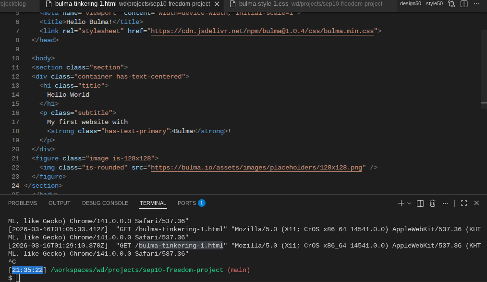

# Entry 4 : Choosing a Tool
##### 03-16-2026
# SEP10 Freedom Project
by **Annabella Shum**

## Content:
Now that I have researched a basic knowledge of business, existing technology, and brainstorming new technology, I'm stepping away from the content to learn a tool for the creative side of the project. I chose bulma which is very similar to the tool, bootstrap and it can help make the layout and view of the webpage. I chose Bulma out of all the tools I saw because other tools like Aframe didn't align with what I wanted to do and the others seemed uninteresting or difficult to navigate. Bulma was appealing because of its smooth looking website making it look easy to use.

When I started tinkering with Bulma I just copy and pasted the different code snippets and see what they did on my own screen in my IDE. I also observed the site and the line of code to see what was affecting the css.

## Links:
To start off, I used a [youtube video](https://www.youtube.com/watch?v=SCSAExGFK1E) to see how I should get started and use the overview page](https://bulma.io/documentation/start/overview/)and copied the starting code and the link to the CSS.

I looked through and found some things that I would possibly use in the webpage like [level](https://bulma.io/documentation/layout/level/) and [responsive images](https://bulma.io/documentation/elements/image/).

Here is where is the link to the page that demonstrate me trying it out:
[link](../bulma-tinkering-1.html)

## Skills:
Learning skills: When starting Bulma, I had no idea what I was doing so I used a guide. Learning by yourself can be hard so it helps to have a starting point. From there I learned not only how I could start Bulma but I learned that there will be a video point of reference that I can use. Using the videos and the directions on the Bulma website, I was able to figure out what I should learn and what they could do. Looking at the site further, it also explains how it works.
Organization: While pasting the code I needed to organize divs and the different things I wanted to do, that way it was easy to find the content I added as well as the content I wanted to delete. I also needed to organize how I wanted to learn. Instead of doing anything I guided myself by what would be most beneficial to learn.

[Previous](entry03.md) | [Next](entry05.md)

[Home](../README.md)
