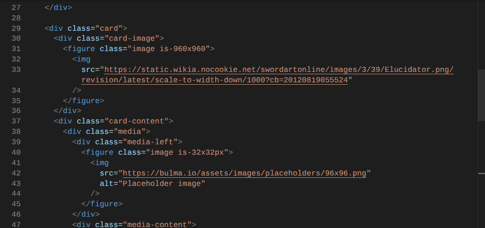

# Entry 5
##### 04/27/2026

## Content:
Now that we have all the information we need for the project, we need to start setting up the website. We learned how to wireframe a website and how to use bootstrap. To add more details, we were tasked to learn a new tool, this time with little to no help. We were on our own to learn this new way to code. We had a variety of options. I chose bulma because it didn’t seem difficult to learn since it's similar to bootstrap. I decided I wanted to try to learn 4 different components that bulma had and looked like I would use. When trying out the actual code I figured out that there were some limitations that made it difficult to use for my website.

This is an example of me attempting to use a card format that bulma offers. I was adjusting the image size to see if I can control how large it was in the card to which it was unsuccessful. What did work was using the given dimensions Bulma gives you for images.

## Skills:
Embracing failure: when we were concluding learning our tool I wanted to make a website using 4 Bulma components, thinking it would be easy and similar to using bootstrap. I was mistaken and found that what I wanted to learn was much more difficult to achieve than I thought. I wasn't able to create a website with Bulma, but that wasn't the focus, it was a goal to help me learn Bulma which it accomplished.
Logical reasoning: To learn Bulma it required some logic to see what div and class did what for the component. Logic also helped me come to the conclusion that with Bulma, there are limitations such as images. If I used a ratio that was not on the website it would not work to resize the image.

## Sources:
   * [breadcrumb](https://bulma.io/documentation/components/breadcrumb/)
   * [card](https://bulma.io/documentation/components/card/)
   * [modal](https://bulma.io/documentation/components/modal/)
   * [pagination](https://bulma.io/documentation/components/pagination/)

[Previous](entry04.md) | [Next](entry06.md)

[Home](../README.md)
